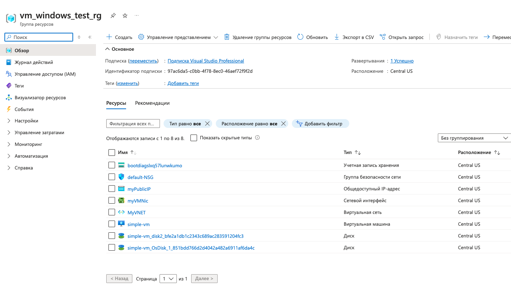

# CloudXAzureDeveloper
# Introduction

## Task

Activate you MSDN Azure benefit

Create Windows VM: Create a Windows virtual machine in Azure 

Optional (create Linux VM): Create a Linux virtual machine in Azure  

# Prerequisites

Azure cli


## Run

1. Log in via azure cli to correct subscription
```cmd
az login
```
2. Create a valid resource group, for example:
```cmd
az group create --name vm_windows_test_rg --location "Central US"
```
3. Deploy

The password must meet the requirements:

Minimum length: 12

``` cmd
az deployment group create \
  --name ExampleDeployment \
  --resource-group vm_windows_test_rg \
  --template-file vm_windows.json \
  --parameters adminUsername=NBulatov \
            adminPassword=<password>
```

4. Result

As a result I had the created resources in my recource group

